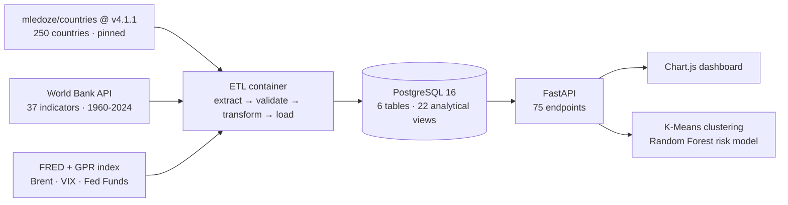

# Countries Macro Platform 🌍

**EN** | [ES](#es)

> From three public APIs to a queryable macroeconomic history of the world — 60 years of country-level data, extracted, validated, modelled in SQL and served as an analytical API.

**Live case study:** [Is Spain a strong economy?](https://guillermoblanca.github.io/etl-countries/) — a self-contained report built entirely on this pipeline's output.

---

## What this is

A containerised data platform that ingests country data from three independent public sources, reconciles them into a single panel dataset (country × year × indicator), builds an analytical layer in PostgreSQL, and exposes it through a FastAPI service with 75 endpoints — including two ML models trained at startup.

It began as an ETL exercise. It ended up answering questions like *which countries recover fastest from oil shocks*, *which economies are structurally alike regardless of geography*, and *does a country's current macro pattern resemble that of economies historically in crisis*.



## Data sources

| Source | What it provides | Access |
|---|---|---|
| [mledoze/countries](https://github.com/mledoze/countries) `v4.1.1` | Base entities: 250 countries, region, subregion, capital, area, currencies, flags | Static dataset, pinned tag — no key, no rate limit |
| [World Bank Open Data](https://data.worldbank.org) | 37 macro indicators, 1960–2024, plus population and Gini (GDP, employment by sector, trade, debt, R&D, energy) | Public REST API |
| [FRED](https://fred.stlouisfed.org) + [GPR Index](https://www.matteoiacoviello.com/gpr.htm) | Global context: Brent crude, VIX, Fed Funds rate, geopolitical risk | CSV/XLS download |

Reference data is read from the source dataset at a **pinned tag** rather than through a hosted API. Same tag, same 250 countries, forever — and no third party can deprecate the build. The reason that matters is below.

Twelve **historical shock windows** (1973 oil crisis → 2022 Ukraine war and inflation) are modelled as first-class entities, which is what makes crisis-impact analysis possible: every country-year can be labelled by the shock it was living through.

## What it demonstrates

- **Multi-source ingestion with reconciliation** — three sources with different country keys, granularities and coverage, joined on ISO `cca2` into one coherent panel
- **Orchestration with real dependencies** — Docker Compose with a Postgres `healthcheck`, and an API that starts only on `service_completed_successfully` of the ETL. A minimal DAG, expressed in Compose
- **Analytical modelling in SQL** — 22 views and materialised views (YoY changes, crisis impact, recovery curves, economic archetypes, convergence, external vulnerability, peer groups, ML feature tables)
- **ML on top of the warehouse** — K-Means clustering with automatic *K* selection by silhouette, and a Random Forest risk classifier, both trained at API startup from a materialised feature view
- **Statistical care** — see below. This is the part I would defend in an interview

## The failure this repo now documents

While preparing this project for publication, I ran the pipeline end to end and read the logs. One line:

```
REST Countries → 3 records
```

It should have been 250. The REST Countries v3.1 API had been deprecated and was answering **HTTP 200** with an error envelope:

```json
{"success": false, "data": null,
 "errors": [{"message": "This API version has been deprecated..."}]}
```

The extractor called `len()` on that dict, got `3` — its key count — logged "3 records" and continued. Every downstream stage did its job perfectly on three phantom countries. No exception, no non-zero exit, no alert. Compose reported `service_completed_successfully`, which was true and useless.

The dead API was the trivial half of the problem. The real defect was mine: **the pipeline had no opinion about what good input looks like.** Anything JSON-shaped was acceptable.

What changed:

- Reference data now comes from the **source dataset at a pinned tag**, not a hosted API. Removes the vendor, the key requirement and the rate limit in one move, and makes builds reproducible.
- `validate_countries()` rejects anything that is not a list, is shorter than 200 records, is missing required fields, or contains a record without an ISO code — and **raises** rather than degrading.
- Population and Gini now come from the World Bank, where they are dated series rather than undated snapshots. This fixed a limitation I had previously documented and shipped anyway.
- A test suite pins the behaviour, starting with a regression test that feeds the exact error envelope to the validator and asserts it raises.

The lesson, kept here on purpose rather than quietly patched: a silent success is more expensive than a loud failure. It cost nothing here because I read the logs before publishing. In production it would have been a dashboard confidently showing three countries.

## Two methodological decisions worth reading the code for

**1. Correlations are computed on pooled country-year observations, not on averaged series.**

Averaging each indicator per region and *then* correlating produces spurious results: you end up measuring whether two trends both slope upward over time, not whether they actually move together. The pipeline pivots to one row per `(country, year)` and requires a minimum of 30 observations per region and 20 per pair before reporting an *r*.

```python
# etl/transform.py
pivot = rdf.pivot_table(index=["cca2", "year"], columns="indicator_code", values="value")
if len(pivot) < 30:      # need enough country-year points
    continue
corr = pivot.corr(method="pearson", min_periods=20)
```

Every reported correlation ships with its `n_obs`, so a reader can judge it.

**2. The risk model is validated out-of-sample in time, and framed honestly.**

Training uses the 1965–2014 panel; testing uses 2015–2024 — a genuine temporal split, not a random one, because a random split would leak the future into the training set through neighbouring years of the same country.

And the model does *not* claim to predict crises. Quoting its own docstring:

> This model does NOT predict the calendar date of the next crisis. It predicts the probability that a country's current macro pattern matches the pattern of countries historically classified as 'in crisis'. Treat output as a risk score, not as a forecast.

Measured out-of-sample on 2015–2024:

| Metric | Value | Reading |
|---|---|---|
| ROC-AUC | 0.868 | Ranks risk well |
| Precision | 1.00 | When it flags a country, it has been right |
| Recall | 0.29 | It stays silent about most crisis-like country-years |
| F1 | 0.45 | The consequence of the two above |

That asymmetry is the honest headline: this is a **conservative screen, not a detector**. And a caveat I would rather state than bury — the 12 shock windows cover enough of 1965–2024 that "in crisis" is a *majority* label (54% positive on the training panel), so the majority-class baseline is already 54%, not 50%. The AUC is what carries the result, not the accuracy.

The clustering is reported with the same discipline: K=3 over 180 countries, **silhouette 0.185** — a weak score. Economies form a continuum rather than separate species, so the clusters are a coarse ordering, not a discovery. Raising that number would have meant dropping features until the data agreed with the method.

Both models expose their metrics at `/ml/predict/model-info` and `/ml/clusters/info`.

## Stack

`Python 3.12` · `pandas` · `scikit-learn` · `PostgreSQL 16` · `FastAPI` · `Docker Compose` · `Chart.js`

## Quick start

```bash
cp .env.example .env

# Download the global-context datasets (Brent, VIX, Fed Funds, GPR).
# These are gitignored — the repo ships code, not data.
python scripts/download_fred.py

docker compose up --build
```

Open [http://localhost:8080](http://localhost:8080). If that port is taken, set `API_PORT` in your `.env`.

The ETL container runs first and exits; the API starts only once it has completed successfully, then trains both ML models before serving. First run takes a few minutes — it is pulling 60 years of World Bank series.

## Tests

```bash
docker run --rm -v "$PWD:/app" -w /app python:3.12-slim \
  sh -c "pip install -q -r requirements-dev.txt && python -m pytest -q"
```

21 tests, no network and no database — they run against the pure transform and
validation functions:

| Area | What is asserted |
|---|---|
| Input validation | Error envelopes, truncated payloads, missing fields and code-less records all raise |
| Keys | `cca2` unique, two uppercase letters, every indicator row references a known country |
| Derived metrics | Density equals population ÷ area, and is null when area is missing or zero |
| Source of truth | Population and Gini are non-null and in range — i.e. the World Bank merge actually happened |
| Rankings | Start at 1, never exceed the group size, and the #1 country really is the largest |
| Aggregates | Region counts and populations reconcile with the country table |
| Correlations | Bounded in [-1, 1], never self-paired, and every row carries `n_obs ≥ 20` |

## API surface

75 endpoints, grouped:

| Group | Examples | Purpose |
|---|---|---|
| Reference | `/api/countries`, `/api/regions` | Base entities and aggregates |
| Time series | `/api/timeseries/{cca2}/{indicator}`, `/api/timeseries/world/{indicator}` | 60-year series per country, region or world |
| Correlations | `/api/correlations`, `/api/correlations/matrix/{region}` | Pearson pairs with `n_obs` |
| Crisis analysis | `/analytics/crisis-impact/{cca2}`, `/analytics/macro-story/{hito_id}` | Country behaviour across the 12 shock windows |
| Strength & profile | `/analytics/strength`, `/analytics/country/{cca2}/profile` | Composite indices |
| ML | `/ml/clusters/*`, `/ml/predict/*`, `/ml/features.csv` | Clustering, risk scores, feature export |
| Docs | `/methodology` | How every metric is computed |

Interactive OpenAPI docs at `/docs` once running.

## Project structure

```
etl_countries/
├── docker-compose.yml          # db (healthcheck) → etl → api
├── db/
│   ├── init.sql                # 6 base tables + 12 historical shock windows
│   └── analytics_views.sql     # 22 views / materialised views
├── etl/
│   ├── extract.py              # REST Countries + World Bank
│   ├── extract_global.py       # FRED + geopolitical risk index
│   ├── transform.py            # cleaning, derived metrics, correlations
│   ├── load.py                 # bulk load into PostgreSQL
│   └── main.py                 # pipeline entry point
├── api/
│   ├── main.py                 # FastAPI app + endpoints
│   └── services/
│       ├── analytics.py        # milestone correlation
│       ├── cluster_analyzer.py # K-Means + PCA + silhouette
│       └── crisis_predictor.py # Random Forest risk model
├── scripts/
│   ├── download_fred.py        # fetch global-context datasets
│   └── build_case_study.py     # render the static Spain report
└── docs/                       # GitHub Pages case study
```

## Secrets

Credentials live in `.env`, which is gitignored. Copy `.env.example` and fill it in — the defaults work for local use.

## Known limitations

Stated plainly, because a portfolio project that claims to be finished is lying:

- **`api/main.py` is too large** at ~2.9k lines. The service layer is already extracted; the endpoints need splitting into FastAPI routers by domain. This is the next job.
- **Tests cover extraction and transformation, not the SQL layer.** The 22 views have no assertions on them yet. A `pytest` + testcontainers pass over the materialised views is the natural follow-up.
- **World Bank coverage is uneven.** Small states and several African countries have sparse series. `country_indicator_coverage` exposes this per country rather than hiding it, but any cross-country comparison should be read with it in hand.
- **Pinning the reference dataset trades freshness for reproducibility.** New countries or boundary changes require a deliberate tag bump. That is the intended trade — but it is a trade.

## Licence

Code: MIT.

Country reference data from [mledoze/countries](https://github.com/mledoze/countries), licensed **ODbL-1.0** — attribution required, and derived databases inherit the licence. World Bank indicators are CC-BY-4.0.

---

<a name="es"></a>

# Plataforma Macro de Países 🌍

[EN](#countries-macro-platform-) | **ES**

> De tres APIs públicas a una historia macroeconómica del mundo consultable — 60 años de datos por país, extraídos, validados, modelados en SQL y servidos como API analítica.

**Caso de estudio en vivo:** [¿Es España una economía fuerte?](https://guillermoblanca.github.io/etl-countries/) — un informe autocontenido construido íntegramente sobre la salida de este pipeline.

---

## Qué es esto

Una plataforma de datos contenerizada que ingiere datos de países desde tres fuentes públicas independientes, las reconcilia en un único dataset panel (país × año × indicador), construye una capa analítica en PostgreSQL y la expone mediante un servicio FastAPI con 75 endpoints, incluyendo dos modelos de ML que se entrenan al arrancar.

Empezó como un ejercicio de ETL. Acabó respondiendo preguntas como *qué países se recuperan más rápido de los shocks del petróleo*, *qué economías se parecen estructuralmente al margen de la geografía* o *si el patrón macro actual de un país se parece al de economías históricamente en crisis*.

## Fuentes de datos

| Fuente | Qué aporta | Acceso |
|---|---|---|
| [mledoze/countries](https://github.com/mledoze/countries) `v4.1.1` | Entidades base: 250 países, región, subregión, capital, superficie, monedas, banderas | Dataset estático en tag fijado — sin key ni rate limit |
| [World Bank Open Data](https://data.worldbank.org) | 37 indicadores macro, 1960–2024, más población y Gini (PIB, empleo sectorial, comercio, deuda, I+D, energía) | API REST pública |
| [FRED](https://fred.stlouisfed.org) + [Índice GPR](https://www.matteoiacoviello.com/gpr.htm) | Contexto global: Brent, VIX, tipo Fed Funds, riesgo geopolítico | Descarga CSV/XLS |

Los datos de referencia se leen del dataset origen en un **tag fijado**, no a través de una API alojada. Mismo tag, mismos 250 países, siempre — y ningún tercero puede deprecarte el build. Por qué eso importa, justo abajo.

Doce **ventanas de shock histórico** (del crudo de 1973 a la guerra de Ucrania e inflación de 2022) están modeladas como entidades de primer nivel, y eso es lo que hace posible el análisis de impacto de crisis: cada par país-año puede etiquetarse con el shock que estaba atravesando.

## Qué demuestra

- **Ingesta multi-fuente con reconciliación** — tres fuentes con claves de país, granularidades y cobertura distintas, unidas por ISO `cca2` en un panel coherente
- **Orquestación con dependencias reales** — Docker Compose con `healthcheck` en Postgres y una API que arranca sólo con `service_completed_successfully` del ETL. Un DAG mínimo, expresado en Compose
- **Modelado analítico en SQL** — 22 vistas y vistas materializadas (variaciones interanuales, impacto de crisis, curvas de recuperación, arquetipos económicos, convergencia, vulnerabilidad externa, grupos de pares, tablas de features para ML)
- **ML sobre el almacén** — clustering K-Means con selección automática de *K* por silhouette y un clasificador Random Forest de riesgo, ambos entrenados al arrancar la API desde una vista materializada de features
- **Cuidado estadístico** — ver abajo. Es la parte que defendería en una entrevista

## El fallo que este repo documenta

Preparando el proyecto para publicarlo, ejecuté el pipeline de punta a punta y leí los logs. Una línea:

```
REST Countries → 3 records
```

Deberían haber sido 250. La API de REST Countries v3.1 estaba deprecada y respondía **HTTP 200** con un sobre de error:

```json
{"success": false, "data": null,
 "errors": [{"message": "This API version has been deprecated..."}]}
```

El extractor llamó a `len()` sobre ese diccionario, obtuvo `3` — el número de claves —, registró "3 records" y siguió adelante. Todas las etapas posteriores hicieron su trabajo perfectamente sobre tres países fantasma. Ni excepción, ni salida distinta de cero, ni alerta. Compose informó `service_completed_successfully`, lo cual era cierto e inútil.

La API muerta era la mitad trivial del problema. El defecto real era mío: **el pipeline no tenía ninguna opinión sobre qué aspecto tiene un buen input.** Cualquier cosa con forma de JSON valía.

Qué cambió:

- Los datos de referencia vienen ahora del **dataset origen en un tag fijado**, no de una API alojada. Elimina al proveedor, el requisito de API key y el rate limit de una vez, y hace los builds reproducibles.
- `validate_countries()` rechaza cualquier cosa que no sea una lista, que tenga menos de 200 registros, a la que le falten campos obligatorios o que contenga un registro sin código ISO — y **lanza excepción** en vez de degradarse.
- Población y Gini vienen ahora del Banco Mundial, donde son series con fecha en lugar de instantáneas sin año. Esto arregló una limitación que yo mismo había documentado y publicado igualmente.
- Una batería de tests fija el comportamiento, empezando por un test de regresión que le da al validador exactamente ese sobre de error y comprueba que revienta.

La lección, conservada aquí a propósito en vez de parcheada en silencio: **un éxito silencioso sale más caro que un fallo ruidoso.** Aquí no costó nada porque leí los logs antes de publicar. En producción habría sido un dashboard enseñando tres países con total confianza.

## Dos decisiones metodológicas por las que merece la pena leer el código

**1. Las correlaciones se calculan sobre observaciones país-año agrupadas, no sobre series promediadas.**

Promediar cada indicador por región y *después* correlacionar produce resultados espurios: acabas midiendo si dos tendencias suben a la vez con el tiempo, no si realmente se mueven juntas. El pipeline pivota a una fila por `(país, año)` y exige un mínimo de 30 observaciones por región y 20 por par antes de reportar una *r*.

Cada correlación publicada viene con su `n_obs`, para que quien la lea pueda juzgarla.

**2. El modelo de riesgo se valida fuera de muestra en el tiempo, y se presenta con honestidad.**

El entrenamiento usa el panel 1965–2014; el test usa 2015–2024 — una separación temporal real, no aleatoria, porque una aleatoria filtraría el futuro al entrenamiento a través de años contiguos del mismo país.

Y el modelo no pretende predecir crisis. Citando su propio docstring:

> Este modelo NO predice la fecha del calendario de la próxima crisis. Predice la probabilidad de que el patrón macro actual de un país coincida con el patrón de países históricamente clasificados como 'en crisis'. Trata la salida como una puntuación de riesgo, no como una previsión.

Medido fuera de muestra sobre 2015–2024:

| Métrica | Valor | Lectura |
|---|---|---|
| ROC-AUC | 0.868 | Ordena bien el riesgo |
| Precisión | 1.00 | Cuando señala un país, ha acertado |
| Recall | 0.29 | Se calla ante la mayoría de años-país con pinta de crisis |
| F1 | 0.45 | La consecuencia de las dos anteriores |

Esa asimetría es el titular honesto: esto es un **filtro conservador, no un detector**. Y una advertencia que prefiero decir a esconder: las 12 ventanas de shock cubren suficiente del periodo 1965–2024 como para que "en crisis" sea la etiqueta *mayoritaria* (54% de positivos en el panel de entrenamiento), así que la línea base de clase mayoritaria ya es 54%, no 50%. Lo que sostiene el resultado es el AUC, no la accuracy.

El clustering se reporta con la misma disciplina: K=3 sobre 180 países, **silhouette 0.185** — una puntuación baja. Las economías forman un continuo, no especies separadas, así que los clusters son una ordenación gruesa, no un descubrimiento. Subir ese número habría significado quitar features hasta que el dato le diera la razón al método.

Ambos modelos exponen sus métricas en `/ml/predict/model-info` y `/ml/clusters/info`.

## Stack

`Python 3.12` · `pandas` · `scikit-learn` · `PostgreSQL 16` · `FastAPI` · `Docker Compose` · `Chart.js`

## Inicio rápido

```bash
cp .env.example .env

# Descarga los datasets de contexto global (Brent, VIX, Fed Funds, GPR).
# Están gitignorados — el repo lleva código, no datos.
python scripts/download_fred.py

docker compose up --build
```

Abre [http://localhost:8080](http://localhost:8080). Si ese puerto está ocupado, ajusta `API_PORT` en tu `.env`.

El contenedor ETL se ejecuta primero y finaliza; la API arranca sólo cuando ha terminado con éxito, y entonces entrena ambos modelos antes de servir. La primera ejecución tarda unos minutos — está descargando 60 años de series del Banco Mundial.

## Tests

```bash
docker run --rm -v "$PWD:/app" -w /app python:3.12-slim \
  sh -c "pip install -q -r requirements-dev.txt && python -m pytest -q"
```

21 tests, sin red y sin base de datos — se ejecutan sobre las funciones puras de
transformación y validación:

| Área | Qué se comprueba |
|---|---|
| Validación de entrada | Sobres de error, payloads truncados, campos ausentes y registros sin código lanzan excepción |
| Claves | `cca2` único, dos letras mayúsculas, toda fila de indicador referencia a un país conocido |
| Métricas derivadas | La densidad es población ÷ superficie, y es nula si falta la superficie o es cero |
| Origen del dato | Población y Gini no son nulos y están en rango — es decir, el cruce con el Banco Mundial ocurrió de verdad |
| Rankings | Empiezan en 1, nunca superan el tamaño del grupo, y el país #1 es realmente el mayor |
| Agregados | Los recuentos y poblaciones por región cuadran con la tabla de países |
| Correlaciones | Acotadas en [-1, 1], nunca consigo mismas, y toda fila lleva `n_obs ≥ 20` |

## Superficie de la API

75 endpoints, agrupados:

| Grupo | Ejemplos | Para qué |
|---|---|---|
| Referencia | `/api/countries`, `/api/regions` | Entidades base y agregados |
| Series temporales | `/api/timeseries/{cca2}/{indicador}` | Series de 60 años por país, región o mundo |
| Correlaciones | `/api/correlations/matrix/{region}` | Pares de Pearson con `n_obs` |
| Análisis de crisis | `/analytics/crisis-impact/{cca2}` | Comportamiento del país en las 12 ventanas de shock |
| Fortaleza y perfil | `/analytics/strength`, `/analytics/country/{cca2}/profile` | Índices compuestos |
| ML | `/ml/clusters/*`, `/ml/predict/*`, `/ml/features.csv` | Clustering, riesgo, exportación de features |
| Documentación | `/methodology` | Cómo se calcula cada métrica |

Documentación OpenAPI interactiva en `/docs` con el stack levantado.

## Secretos

Las credenciales viven en `.env`, que está gitignorado. Copia `.env.example` y rellénalo — los valores por defecto sirven para uso local.

## Limitaciones conocidas

Dichas claramente, porque un proyecto de portfolio que se presenta como terminado está mintiendo:

- **`api/main.py` es demasiado grande**, ~2.9k líneas. La capa de servicios ya está extraída; faltan partir los endpoints en routers de FastAPI por dominio. Es el siguiente trabajo.
- **Los tests cubren extracción y transformación, no la capa SQL.** Las 22 vistas todavía no tienen aserciones. Una pasada con `pytest` + testcontainers sobre las vistas materializadas es la continuación natural.
- **La cobertura del Banco Mundial es desigual.** Estados pequeños y varios países africanos tienen series dispersas. `country_indicator_coverage` lo expone por país en vez de esconderlo, pero cualquier comparación entre países debería leerse con esa vista delante.
- **Fijar el dataset de referencia cambia frescura por reproducibilidad.** Países nuevos o cambios de fronteras exigen subir el tag a mano. Es el intercambio buscado — pero es un intercambio.

## Licencia

Código: MIT.

Datos de referencia de países de [mledoze/countries](https://github.com/mledoze/countries), bajo **ODbL-1.0** — requiere atribución, y las bases de datos derivadas heredan la licencia. Los indicadores del Banco Mundial son CC-BY-4.0.
